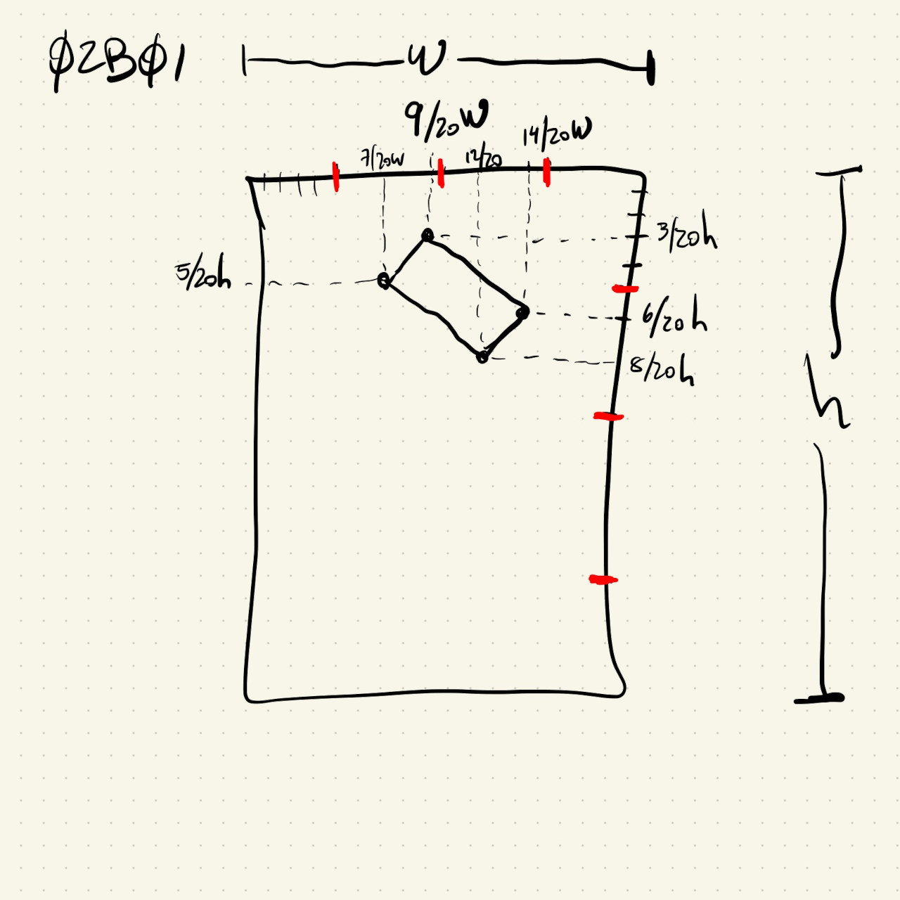

# HW02B

Recreating some Kazimir Malevich paintings.

## HW02B01

I decided to implement this one using quads. I mentally divided the painting into a 20 x 20 grid and used those points to best approximate ```quad()``` vertices as a percentage of the painting width and height:



## HW02B02

I used a similar strategy to implement this one. I divided the painting in a 20 x 20 grid and approximated the vertices of the ```quad()``` shapes as a percentage of the width or height. This one had more straight rectangles and was a little bit easier.

## HW02B03

I tried a different approach for this one. It looked like most of the tilted rectangles were tilted by the same amount, so it was a good opportunity to try out the rotate function. After drawing the regular yellow square on the bottom right, I drew regular rectangles along the left edge of the painting area. Once they looked ok in terms of size and relative positioning I added ```rotate(-PI/5)``` before all of their draw commands. If I were to keep drawing on this sketch I would have to remember to un-rotate (```rotate(PI/5)```) before adding other shapes.
